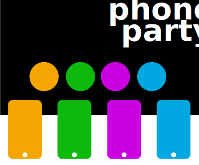

# Phone Party

A framework for party games, where each player connects using their phone and plays together on a shared screen.

Tech:

- [WebRTC](https://developer.mozilla.org/en-US/docs/Web/API/WebRTC_API), for streaming video from selfie cameras and relaying button presses etc.
- [Websockets](https://developer.mozilla.org/en-US/docs/Web/API/WebSockets_API), for brokering WebRTC connections.
- The [Web Audio API](https://developer.mozilla.org/en-US/docs/Web/API/Web_Audio_API), for beeps and boops.
- The [Sensor APIs](https://developer.mozilla.org/en-US/docs/Web/API/Sensor_APIs) for using accelerometer data.


Usage:

*Requies Go

```bash
# Requires websocket library
$ go get github.com/gorilla/websocket

# serves on port 8080
$ go run server.go

# Players will need to connect with HTTPS for video streaming to be allowed.
# Suggestion: forward traffic with serveo.net
$ ssh -R 80:localhost:8080 serveo.net
```

For the shared screen, open a web browser to `(server address)/host`

Each player can load the server address directly in a web browser.

**Note!:** the host and all players will likely need to be on the same Wifi!
